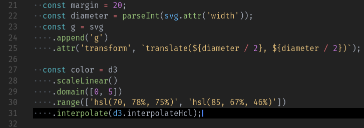

# whoa-theme
VS Code color theme

This is based heavily on [azemoh](https://github.com/azemoh)'s work, [One Monokai](https://github.com/azemoh/vscode-one-monokai), I just modified a couple colors.

